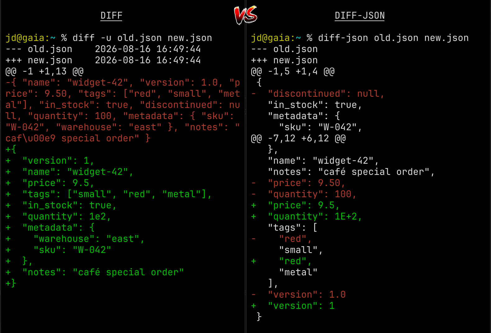

Some command-line utilities I use across my accounts.

Installs with `install-terminal-tools` from my global
[`.zshrc`](https://github.com/jeremy-dolan/dotfiles) (which will also detect
the installation and add appropriate directories to PATH and FPATH).

Public domain (under [CC0](https://creativecommons.org/publicdomain/zero/1.0/)).
Use them however you like.

### [showcolors](bin/showcolors)
Test "ANSI color" and other SGR control sequences. (Python)


### [ssh-diff](bin/ssh-diff)
Diff two files, allowing scp-like paths of the form `[user@]ssh-host:path`.
(bash; wraps `diff` and `ssh`)

```
% ssh-diff sandbox:dev/file host:deploy/file
...
```


### [diff-json](bin/diff-json)
Diff two JSON files after normalizing whitespace and key order. (bash; requires `jq`)




### [diff-odf](bin/diff-odf)
Diff the content and metadata of two OpenDocument files (.odt, .ods, ...).
Requires `unzip`, `xmllint` (part of libxml2; bundled with macOS), `diff`, and
LibreOffice (or an equivalent `soffice` executable)


### [diff-xml](bin/diff-xml)
Diff two XML files after normalizing line breaks and indentation.
This is a line-based diff of the reformatted output, not a semantic XML diff.
It won't detect cosmetic differences like attribute order and `<a/>` vs `<a></a>`.
Requires `xmllint` from libxml2 (bundled with macOS).


### [flac2mp3](bin/flac2mp3)
Convert FLAC files to high-quality VBR MP3. (POSIX sh; requires `ffmpeg`)


### [logininfo](bin/logininfo)
Pretty print some system and terminal info on login. (bash; uses `figlet` if
available)


