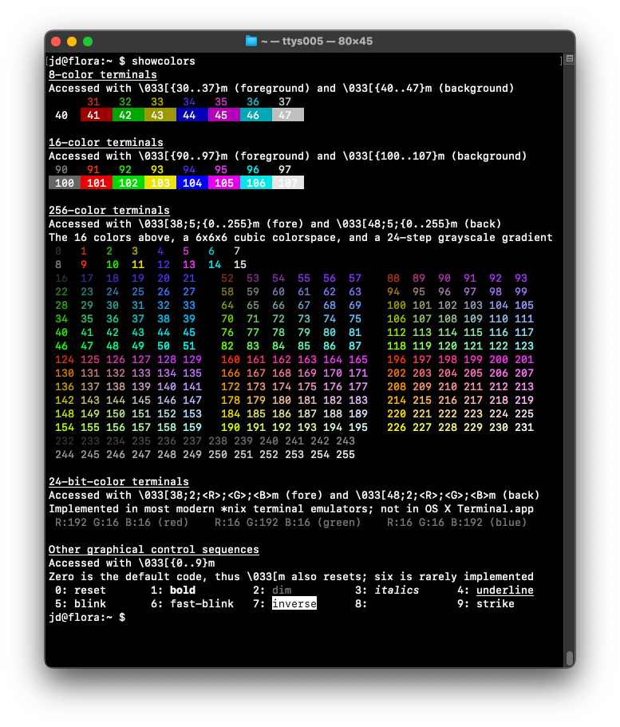

Some doo-dads and whats-its from many years spent at the command line

Slowly publishing things as I find them and clean them up

---

* [logininfo](logininfo) Print some terminal, host, and shell info on login \[POSIX sh\]

* [showcolors](showcolors) - Show/test ANSI control sequences for color (and
  other text decorations) \[Python\]

* [flac2mp3](flac2mp3) - convert flac files to high-quality VBR mp3 \[wrapper
  for ffmpeg\]